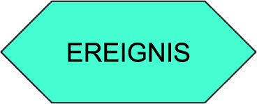
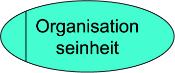
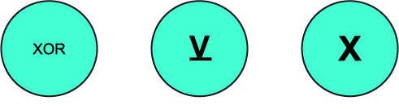
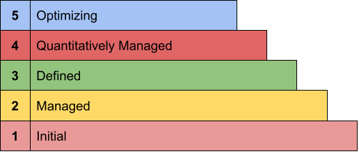

# BGP Prüfung am 22.06.2022
## Stoff
* 1x EPK
* Standards und Zertifizierungen (ISO, CMMI, COBIT)
* Vertragsarten
* Service Level
* Lizenzen

# EPK
| Symbole | Erklärungen | Beispiele |
| ------- | ----------- | --------- |
|  |  Was soll gemacht werden? Eine Funktion ist eine auszuführende Tätigkeit, die von einer Orgnisationseinheit | Anmeldung prüfen, Rechnung bezahlen |
|  |  Was hat sich ereignet, was ist gemacht worden? Ein Ereignis löst einen Prozess aus bzw. ist das Ergebnis einer Tätigkeit | Anmeldung eingegangen, Bewerber angenommen, Rechnung i. O. |
|  |  Welche Stelle soll etwas machen? Eine Organisationseinheit ist eine Stelle, Abteilung oder Person | Sekretaeriat, Perosnalabteilung |
|  |  Welche Information unterstützen die Tätigkeiten? Das Informationsobjekt enthält adie für die Durchführung der Funktion notwendigen Daten. Das Informationsobjekt kann nur mit der Funkton verbunden werden | Begleitschreiben, Beistellungen, Karteikarten, Notizzettel |
|  |  Schriftliche Dokumente die durch das Unternehmen "wandern" bzw. in den Betrieb gelangen oder nach außen gesendet werden. |  |
|  |  Der Weg der Abarbeitung verzweigt sich. Er kann nur jeweil eine Richtung nehmen. Entweder ... oder | Rechnung prüfung ergibt entweder Rechnung i.O. oder Rechnung nicht i.O. |
|  |  Der Weg der Abarbeitung gabelt sich in mehrere Wege, die alle ausgeführt werden müssen. | Rechnung ausdrucken und Rechnungsdoppel ablegen |
|  |  Der Weg der Abarbeitung gabelt sich in mehrere Wege, die wahlweise alle, teilweise oder auch separat ausgeführt werden. | Bewerber anschreiben und / oder anrufen |

# Standards und Zertifizierungen 
## **ISO**
Die Internationale Organisation für Normung – kurz ISO  – ist die internationale Vereinigung von Normungsorganisationen und erarbeitet internationale Normen in allen Bereichen mit Ausnahme der Elektrik und der Elektronik, für die die Internationale elektrotechnische Kommission (IEC) zuständig ist, und mit Ausnahme der Telekommunikation, für die die Internationale Fernmeldeunion (ITU) zuständig ist. Gemeinsam bilden diese drei Organisationen die WSC (World Standards Cooperation).

### **Übungen**
* Basistandard von ISO 20000 sind ITIL und FitSM
    * Nein, ein ISO 20000-Zertifikat ist der Beleg dafür, dass eine Organisation zuverlässig Service in-house Qualität erbringt.
* Welche Hauptunterschiede gibt es zwischen ITIL und ISO 20000
    * ITIL-Qualifkation sind nur für Einzelpersonen möglich
    * ISO 20000 Qualifikationen sind auch für Organisationen möglich
    * ITIL ist eine bewährte und detaillierte Sammlumg von Best-Practice-Empfehlungen
    * ISO 20000 ist ein internationaler Standard der Serice-Manangment-Anforderungen an IT-Organisation definiert

## **CMMI**
Das Capability Maturity Model Integration (CMMI) der ISACA ist eine Familie von Referenzmodellen für unterschiedliche Anwendungsgebiete – derzeit für die Produktentwicklung, den Produkteinkauf und die Serviceerbringung. Ein CMMI-Modell ist eine systematische Aufbereitung bewährter Praktiken, um die Verbesserung einer Organisation zu unterstützen. Ein CMMI-Modell kann genutzt werden, um
* einen Überblick über bewährte Praktiken (z. B. bei der Projektplanung) zu bekommen,
* die Stärken und Schwächen einer Organisation objektiv zu analysieren oder
* Verbesserungsmaßnahmen zu bestimmen und in eine sinnvolle Reihenfolge zu bringen.

| Stufe | Fokus | Prozesse |
| - | - | - |
| 5 | Kontinuierliche Verbesserung | Ursachenanalyse und beisitigung |
| 4 | Metrik | Organisationsweite Prozessleitung |
| 3 | Organisation | Entscheidungsfindung, Produktintegration |
| 2 | Projekt | Konfigurationsmanagment, Projektplanung |
| 1 | | Vergeben ohne Vorbedingung |

### **Übungen**
* Welchen Nutzen hat das CMMI-Modell?
    * CMMI kann als eine Art Benchmark für die Fähigkeit eines Unternehmens genutzt werden. Oder als externe Sicht zur Verbesserung der eigenen Organisation
* Was versteht man unter den Fähigkeitsgraden im Unterschied zu den Reifegraden?
    * Fähigkeitsgrad wird für jeden PRozess sperart gemessen. Dabei gibt es vier utnerschiedliche Stuffen (unvollstänmdig durchgeführt, durchgeführt, geführt, definiert)
* CMMI ist als Standadisierung von Reifegraden bekannt.
    * Ja der Reifegrad im CMMI-Modell ist ein häufig benutzer Benchmark für die Fähigkeiten eines Unternehmsn. (Department of Defense möchte mindestens CMMI Reifegrad 3 sehen um Aufträge zu erteilen)

 

## **COBIT**
COBIT (Control Objectives for Information and Related Technology) ist ein international anerkanntes Framework zur IT-Governance und gliedert die Aufgaben der IT in Prozesse und Control Objectives. COBIT definiert hierbei nicht vorrangig wie die Anforderungen umzusetzen sind, sondern primär was umzusetzen ist.

COBIT wurde ursprünglich (1996) vom internationalen Verband der IT-Prüfer ISACA entwickelt. COBIT hat sich von einem Werkzeug für IT-Prüfer (Auditoren) zu einem Werkzeug für die Steuerung der IT aus Unternehmenssicht entwickelt und wird unter anderem auch als Modell zur Sicherstellung der Einhaltung gesetzlicher Anforderungen (Compliance) eingesetzt. Dies fördert die IT-Industrialisierung.

Managment will **Vorhersagbarkeit, Zuverlässigkeit und Gewissheit**. COBIT besteht grundsätzlich aus 3 Teilen.
* Process Model
* Best Practices
* Managment Tools

### Process Model
Das Process Model hilft Unternehmen, die Natur all dieser IT-bezogenen Aktivitäten zu verstehen und sie so zu organisieren, dass sie von allen Beteiligten zuverlässig durchgeführt und verstanden werden können.
Dies sind Processe wie Strategien definieren oder Dinge wie das Betreiben eines Servicedesks. 
Diese Prozesse werden so ausgeführt das es klar ist was dieser Prozess tun soll wie er aufgebaut ist und wer daran teil nehmen soll.

### Best Practices
COBIT bietet Anleitungen, was in diesen Prozessen in Übereinstimmung mit anerkannten bewährten Verfahren zu tun ist. 

### Managment Tools
COBIT stellt eine reihe an Werkzeugen zur verfügung um feststellen zu können ob die Best Practices tatsächlich angewendet werden. 

### Summary
COBIT ist da, um gute Prozesse, gute Ziele und bewährte Praktiken sowie Werkzeuge für das Management bereitzustellen, um sicherzustellen, dass sie ihre Arbeit gut und zuverlässig erledigen, um das erwartete Ergebnis zu erzielen

### **Übungen**
* COBIT ist besonders bekannt als Standard für IT-Governance.
    * Ja, COBIT 5 definiert für grundlegende Prinzipien für die Governance und das Managment der Unternehmens-IT. 
* Was sind die wesentlichen Prinzipien von COBIT
    * Eines der wesentlichen Prinzipien ist die Unterscheidung ztwischen Governance (Vorgabe der Richtung, Priorisierung und Festlegung der Unternehmensziele) und Managment (Planung, Implementierung. Durchführung und Überwachung der notwendigen Aktivitäten)
    * Der ganzheitliche Ansatz
    * Abdeckung des gesamten Unternehmen

 

## **ITIL**
| ITIL v3 | ITIL v4 |
| - | - |
| Prozesse | Praktiken (practices) |
|           | Ansätze wie lean, agil, collaboration rücken stärker in den Vordergrund
| Lebenszyklus (Life cycle) | Service-Wert-System (Service Value System)
| Strategy, Design, Transition, Operation, Improvement | Kernaktivitäten: plan, engange, design and transition, obtain / build, deliver / support, improve
| |  Mehrwert / Erwünschte Ergebnisse aus Kundensicht |

Der **Service Lifecycle** wurde in ITIL 4 aufgegeben und durch **Prozesse** ersetzt. Aber viele der Praktiken in ITIL 4 entsprechen eindeutig den früheren ITIL-V3-Prozessen.

Darüber hinaus kommen in ITIL 4 neue Inhalte hnzu, um sicherzustellen, dass die Anwender die wichtigen Prinzipien und Knzepte im Service-Managment bessere verstehen. Zentralle Begriffe sind hier z. B. **"Mehrwert" und erwünschte Ergebnisse aus Kundensicht**

### **Übungen**
* ITIL ist das am meisten beachtete Rahmenwerden und berücksichtigt die ISO 9000 und ISO 27000.
    * Ja, ITIL ist das weltweite am meisten berücksichtigte Best-Practice-Rahmenwerk. Die ISO-Normen 9000 und 27000 sind Normen für Qualitätssicherheit und Informationssicherheitsmanagment
* ITIL wird aktuell in Version 6 umgesetzt
    * Nein ,ITIL wird zum 16. Mai 2022 in der Version 4 umgesetzt.

# Vertragsarten
| Vertragsart | Definition |
| - | - |
| AGB | Vorgabe für eine Vielzahl von Verträgen vorfumulierterte Vertragsbedingungen |
| Kaufvertrag | Erwerb einer Sache gegen Kaufpreis als Gegenleistung |
| werkvertrag | Herstellung eines Werkes -> Erfoglsgarantie inbegriffen |
| Dienstvertrag | Diesntleistung gegen Zahlung -> keine Erfolgsgarantie |
| Mietvertrag |  Vertrag über zeitweise Gebrauchsüberlassung gegen Entgelt |
| Leasingvertrag | Nutzungsüberlassung mit mehr Verantwortung für den Leasingnehmer (Instandhaltung, Wartung, etc.) | 

# Software as a Service (SaaS)
**Folgende wichtige Punkte, sollen in einem SaaS-Vertrag gergelt werden:**
* Vertragsart (i.d.R. Miete)
* Vertragspartein
* Datenspeicherung, -sicherung, -sicherheit
* Vertragsgegenstand (Art und Uumfang der Leistungen)
* zusätzliche Leistungen (z. B. Schulungen)
* Vergütung, Zahlungsbedingungen
* Nutzungsrechte
* Gewährleistung und Haftung
* Mitwirkungspflichten des Kunden
* Leistungsgüte (-> SLA)
* Laufzeit, Kündigung, Herausgabe und Löschung von Daten
* Verarbeitung personenbezogener Daten
* Wartungszeit, Störungsmanagment
* Schlussbestimmungen

 

**Welche der genannten Verträge bzw. Rechte sind betroffen:**
| Serviceleistung | Recht / Vertrag |
| - | - |
| Nutzung von SaaS | (in der Regel) Mietvertragsrecht |
| Aktualisierung der Software, Updates u.Ä. | Werkvertragsrecht |
| Customizing (z.B. Anpassung der Software) | Werkvertragsrecht |
| Überlassung von IT-Speicherplatz | Mietvertragsrecht |

# Service Level
Bei der Planung und Durchführung der Services sind Unternehmen vielen Risiken ausgesetzt. Da Risiken die geschäftschancen und sogar die Existenz des Unternehmens gefähhrden knnen, wird heutzutage der Forderung nach Governance und damit einem REgelsystem zur Vermeidung der Risiken große Beachtung geschenkt. Eine gutes REgelsysstem nützt jedoch nichts, wenn die Menschen sich gegen die Geltreue des Unternehmens verhalten.

## Steigene Risiken im IT-Service:
* Hackerangriffe, Sicherheitsverletzungen, Datenleaks
* Anspruchsvolle Kunden (Softwarei mmer Komplizierter)
* Gesetzliche Auflage werden immer mehr / Komplexer / verändern sich ständig.

# Lizenzen
| Lizenz | Beschreibung |
| - | - |
| Nutzer-/User-Lizenz | Lizenzsierung eines jeden Softwarebenutzters |
| Client Access License (CAL) | Zugriffslizenz -> Client/Serverumgebung |
| Named User License (NUL) | Lizenzierung auf benannten Benutzer im Unternehmen, der Software ausschließlich nutzen darf |
| Concurrent Access Licence | Lizenz für maximal gleichzeitige Anzahl an Zugriffen auf beliebig viele Rechnern (auch Floating- oder Netzwerklizenzen genant) |
| Key Managment Service (KMS) | Optionen der Aktivierung von Volumenlizenzen -> Aktivierung voin Betriebssystemen innerhalb des eigenen Netzwerkes |
| CPU-Klauseln | in Lizenzbestimmungen führender Softwareherstelle wie Oracle, Microsoft oder IBM verwendet |
| OEM (Original Equipment Manufacturer) | OEM-Lizenzne, häufig wenn Nutzungsgut vorinstalliert, häufig eingeschränkte Rechte, in DE auch ohne Systembindung erhältlicht |
| Maintenance | Wartungs- und Supportdiesnte und -verträge, die von Herstellern zu ihren Produkten angeboten werden |
| SPLA (von Cloud-Solution Providern) | Service-Provider-Liznezen -> Spezielle Lizenzform, bei der man Software-Lizenzen mieten und lizenzrechtlich einwandfrei weitervermieten kann.
| Zweitkopierrechte | Möglichkeit Lizenzen oder Anwendungen jeweils auf einem Rechner und einem Notebook zu nutzen |

# Credit
* [ITpreneurs](https://www.youtube.com/user/itpreneurs)