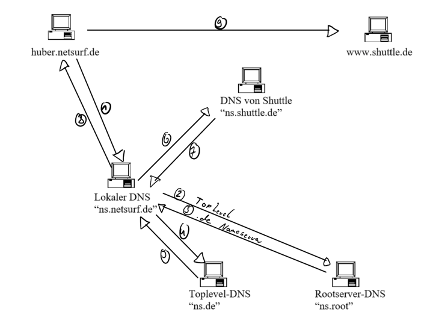

# FU_IT Prüfung am 20.07.2022
## Stoff
* UDP
* DNS
* Kryptografie

# UDP
* OSI-Schicht 4
* UDP arbeitet im "datagram mode" ist also **Verbindungslos**
* Keine Kontrollfunktionen => **Schneller**
* UDP-Header: 8 Byte
* Setzt auf IP auf

# Best-Effort-Service
Ein Best-Effort-Service bezieht sich auf einen Internet-Zustelldienst, bei dem der Anbieter keine Garantie dafür gibt, wann die DAten geliefert werden oder welche Qualität diese Daten bei der Lieferung haben.

# DNS

# Kryptologie
Siehe [Lernmaterial/2. Lehrjahr/FU_IT/29-06-2022.md](https://github.com/APHs-Archive/Lernmaterial/blob/main/2.%20Lehrjahr/FU_IT/29-06-2022.md)

## Symmetrische Verschlüsselung (Sicher -> Unsicher)
* AES 256
* CAMELLIA 256
* AES 192
* CAMELLIA 192
* AES 128
* CAMELLIA 128

## Asymetrische Verschlüsselung (Sicher -> Unsicher)
* ECC 521
* ECC 384
* RSA 8192
* ECC 256

## Hash-Funktionen (Sicher -> Unsicher)
* SHA3 512
* SHA2 512
* RIPE-MD 320
* SHA3 384
* SHA2 384
