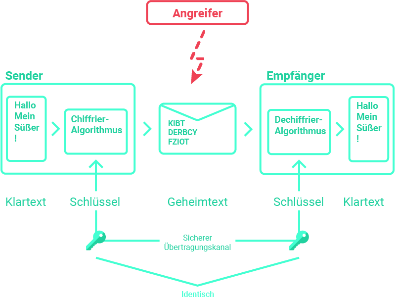
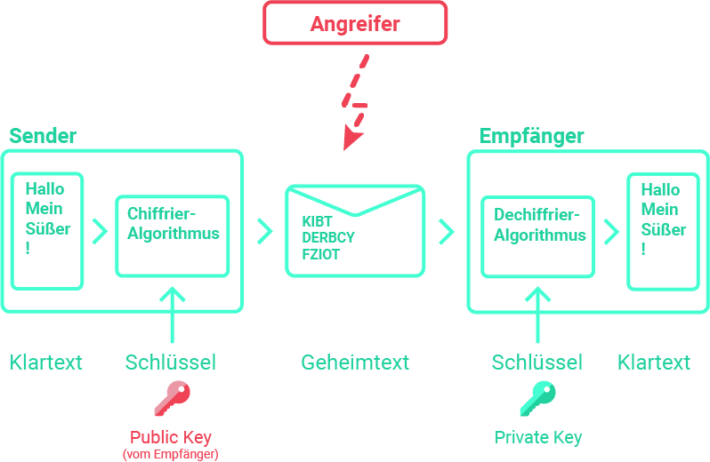
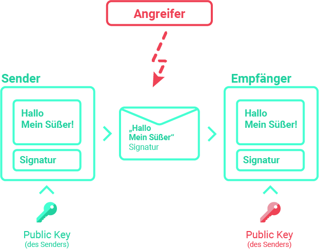

# PuG Prüfung am 29.06.2022
## Stoff
* Verschlüsselungsmethoden
* Asymmetrische Verschlüsslung
* Symmetrische Verschlüsslung
* Digitale Signaturen
* Digitale Zertifikate
* Perfect Forward Secrecy

# Verschlüsselungsmethoden
Benötigt Algorithmus zum Ver- und Entschlüsseln und einen Schlüssel

## Substitution
Ersetzen eines Zeichen durch ein anderes

## Transposition
z.B. Klartext spaltenweise schreiben

## Monoalphabetische Verschlüsselung
Jeder Klartextbuchstabe erhält genau einen Geheimtextbuchstaben

## Polyalphabetische Verschlüsselung
Jeder Klartextbuchstabe kann mehrere Geheimtextbuchstaben erhalten

* AES: Advanced Encryption Standard (> 90%)
* ChaCha20 
* Camellia

# Symmetrische Verschlüsslung

## Verfahren
Sender und Empfänger verwenden den slben Schlüssel zum ver- und entschlüsseln.
Beide Partner müssen den Schlüssel vertraulich halten.

## Probleme
Der Partner muss den Schlüssel auf einem vertraulichen Weg vom Partner erhalten.

# Asymmetrische Verschlüsslung

## Verfahren
Der Sender verschlüsselt mit dem **public key des Empfängers**. Dieser kann öffentlich sein, und muss nicht vertraulich gehalten werden.
Der Empfänger entschlüsselt mit seinem **privaten** Schlüssel.

Öffentliche Schlüssel können nur **verschlüsseln**, aber **nicht entschlüsseln**!
Das Entschlüsseln funktioniert **nur mit dem private key**.
Beide Schlüssel werden vom **Empfänger** erzeugt.

## Analogie
### **Vorhängeschloss an Dose mit geheimen Daten.**
**Öffentlicher Schlüssel:** Vorhängeschloss
**Privater Schlüssel:** Schlüssel für Schloss

Jeder, der im Besitz des **offenem Schlosses** ist, kann die Daten damit einschließen. Nur der Besitzer des **Schlüssels** kann die Daten entnehmen.

## Vorteil
* Es wird kein geheimer Kanal zur Übertragung des öffentlichen Schlüssels benötigt.

## Nachteil
* hoher  Rechenaufwand -> Langsamer
* Geheimtext meist größer als Klartext

## RSA-Verfahren
Das RSA-Verfahren ist ein Asymetrisches Verschlüsselungsverfahren. Es basiert darauf, das es schwer ist, für eine große Zahl **n** zwei Primzahlen **p** und **q** zu finden, für die gilt: **n = p * q**

Die notwendige Bitlänge von **n** (gemäß Bundesamt für Sicherheit in der Informationstechnik) muss der ständig wachsenden Rechenleistung angepasst werden:
* bis Ende 2023: 2048 Bit <- Bitlänge von n
* ab 2024: ?

Aus gegebenem **p** und **q** werden **n** und zwei Zahlen **e**(ncrypt) und **d**(crypt) bestimmt.
* Verschlüsselung: Geheimtextzeichen = (Klartextzeichen)^(e) % n
* Entschlüsselung: Klartextzeichen = (Geheimtextzeichen)^(d) % n

**Public Key:** e; n  
**Private Key:** d; n

Das Problem an dem RSA-Verfahren ist das die Verschlüsselung und entschlüsselung sehr rechenintensiv sind. Daher wird bei PGP (**P**retty **G**ood **P**rivacy) nur der **symmetrsiche Schlüssel** mit RSA verschlüsselt übertragen.

=> Symmetrsicher Schlüssel wird sicher übertragen.

Das RSA-Verfahren wird unteranderm für die sichere Schlüsselübergabe bei PGP sowie für Digitale Signaturen verwendet.

# Digitale Signatur

Mit Hilfe der Digitalen Signatur will man erreichen, dass Jeder verifizieren kann, dass ein Dokument von einem bestimmen Absender und nur von diesem stammt (**Authentizität**). Außerdem muss man dafür sorgen, dass an dem Dokument **keine** nachträglichen **Änderungen** vorgenommen werden können (**Integrität**).

Eine Digitale Signatur ist ein aus dem Dokumenteninhalt berechneter Hashwert, der mit dem **Private key des Senders** verschlüsselt ist und daher nicht unbemerkt **verändert** wereden kann.

## Verfahren
Der Absender erzeugt eine Signatur mittels **asymetrischer Verschlüsselung** und fügt sie dem Dokument bei: Dazu wird aus dem Dokumentinhalt ein Hashwert (Prüfsumme, Finger Print) berechnet, die mit dem **private key des Senders** verschlüsselt wird.

Der Empfänger berechnet nun aus dem Dokumenteninhalt ebenfalls **den Hashwert**. Disen vergleicht er mit dem empfangenem **Hashwert**, der er mit Hilfe des **public key des Senders** dekodiert hat.

Gibt es keine Fehler beim Vergleich der beiden Hashwerte, so ist das Dokument echt, andenfalls ist es manipuliert.

# Digitales Zertifikat
Ein Problem bei der Digitaler Signatur ist wie man sicherstellt, dass der zu verwendendene öffentliche Schlüssel tatsächlich dem angegebenem Absebder gehört.

Die Lösung dafür ist das Digitale Zertifikat. Es fungiert als eine Elektronische Urkunde über die Identität des Besitzes ähnlich eines Personalasuweises. 
Dieser digitale Ausweis wird von einer unabhängigen, vertrauenswürdigen dritten PArtei, der sogenannten **Certification Authority (CA)** ausgestellt und unterzeichnet. (Nach X.509v3 Standard)

## Komponenten eines Digitalen Zertifikats**
* Name des Besitzers
* Gültigkeit
* Öffentlicher Schlüssel des Besitzers
* Signatur der Certification Authority (CA)

Die Schlüssellänge des öffentlichen CA-Schlüssel: i.A. 2048 Bit.

Mit dem öffentlichem Schlüssel der CA kann das Zertifikat verifiziert werden. Dieser öffentliche Schlüssel muss von bieden Kommunikationspartnern anerkannt sein (z.B. im Browser integriert oder mitterls CA-Hierarchie)

# Perfect Forward Secrecy
Perfect Forward Secrecy (PFS) ist eine Methode für den Schlüsselaustausch kryptografischer Verfahren, das die nachträgliche Entschlüsselung durch Bekanntwerden des Hauptschlüssels verhindert. Die Sitzungsschlüssel werden nicht ausgetauscht und sind nicht mehr rekonstruierbar.

Forward Secrecy („vorwärts gerichtete Geheimhaltung“) stellt sicher, dass verschlüsselte Daten auch dann verschlüsselt bleiben, wenn der private Schlüssel offengelegt wird. Dies wird auch als „Perfect Forward Secrecy“ bezeichnet. Forward Secrecy ist möglich, wenn für jede Kommunikationssitzung ein eindeutiger Sitzungsschlüssel verwendet wird und wenn der Sitzungsschlüssel getrennt vom privaten Schlüssel generiert wird. Wenn ein einzelner Sitzungsschlüssel kompromittiert wird, kann nur diese Sitzung von einem Angreifer entschlüsselt werden; alle anderen Sitzungen bleiben verschlüsselt.

In einem Protokoll, das für Forward Secrecy eingerichtet wurde, wird der private Schlüssel während eines anfänglichen Handshake-Prozesses zur Authentifizierung verwendet, ansonsten wird er nicht zur Verschlüsselung genutzt. Der Ephemeral Diffie-Hellman-Handshake generiert Sitzungsschlüssel getrennt vom privaten Schlüssel und besitzt daher Forward Secrecy.

Im Gegensatz dazu hat RSA keine Forward Secrecy: Mit dem kompromittierten privaten Schlüssel könnte ein Angreifer Sitzungsschlüssel für vergangene Konversationen entschlüsseln, weil er das Premaster-Secret entschlüsseln kann und die Client-Randoms und Server-Randoms im Klartext vorliegen. Durch Kombination dieser drei Elemente kann der Angreifer jeden beliebigen Sitzungsschlüssel ableiten.

# Credit
* [Cloudflare](https://www.cloudflare.com/de-de/learning/ssl/keyless-ssl/)
* Some Assets provided by freepik