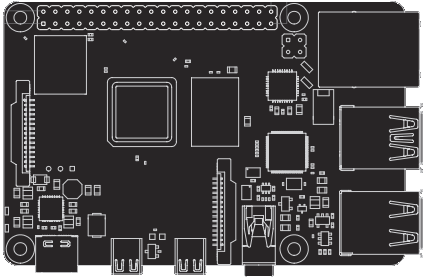
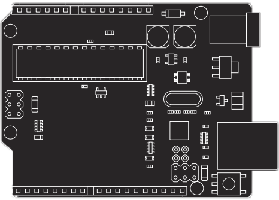
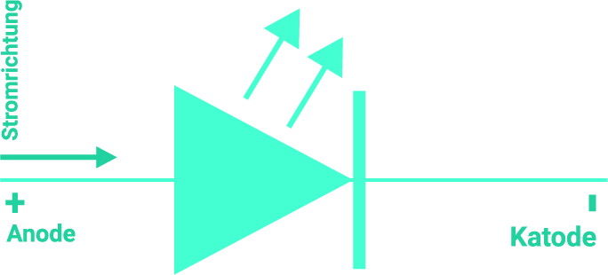
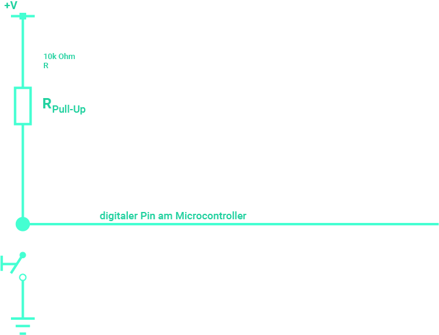
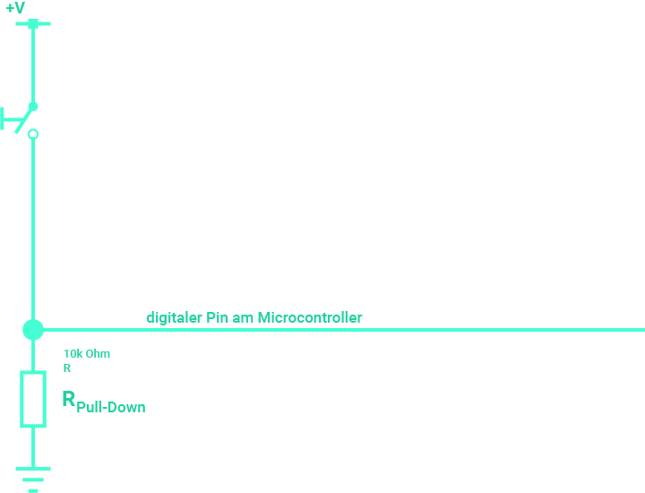
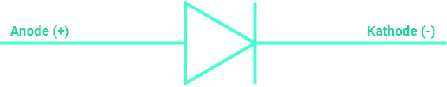

# IT-Tec Prüfung am 23.06.2022
## Stoff
* Unterschied zwischen Raspberry Pi und Arduino
* Komponenten
* Node-RED
* Python
* Rechnen
* Neat to know

# Unterschied zwischen Raspberry Pi und Arduino

| Raspberry Pi | Arduino |
| ------------ | ------- |
| Vollwertiger Computer | Mikrocontroller |
| Vollwertiges Betriebsystem auf Linux Basis | Kein Betriebssystem, führt nur code aus. |

## Vortile & Nachteile

### **Raspberry Pi**

🟢 **Vorteile**
* Starker und schneller Prozessor mit multitasking möglichkeit
* Eingebautes Ethernet, Wifi, Bluetooth
* USB, HDMI, Audio Outputs
* OS alternativen
* Gut für Projekte die Internet benötigen / multitasking fähigkeit benötigen

🔴 **Nachteile**
* Langer Setup mit mit extra componenten
    * Tastatur, Maus und HDMI Monitor
    * Vorher festgelegte Netzerk Einstellungen auf SD Karte
* Zusatz Programme müssen möglicherweiße noch installiert werden
* Teuer

 

### **Arduino**

🟢 **Vorteile**
* Einfaches Verbinden mit Sensoren, Motoren, etc...
* Vielzahl von "Shields" die Funktionalität hinzufügen
* "Plug and Play"
* Günstig

🔴 **Nachteile**
* Kann nur "ein Code" gleichzeitig ausführen
* Je nach model, kein Internet / Bluetooth
* C / C++

# Komponenten
## LEDs

Leichtdioden (LED) sind lichtemittierende Halbleiterdioden und wandeln elektrischen Strom in Licht um. 
Leuchtdioden bestehen aus zwei Schichten. Die dickere Schicht (n-dotierte-Schicht) weist einen Elektronenüberschuss auf und wird als **Kathode** bezeichnet. Die dünnere Schicht (p-dotierte Schicht) hat einen Elektronenmangel und wird als **Anode** bezeichnet.

## Taster
### **Schalter**
Durch den Druck auf den Schalter entsteht eine Brücke zwiscehn den leitenden Verbindungen, wodurch der Stromkreis geschlossen wird und Strom fließt.
Der Schalter bleibt nach dem Druck in der neuen Stellung mit einem wiedertholten Druck auf den Schalter wird die Verbindung getrennt, also der Stromfluss unterbrochen.

### **Taster**
Der Taster ist kein Schalter, der Taster schließt keine Stromkreise, sondern gibt nur Impulse, um einen Stromkreis oder einen Prozess zu aktivieren. Dies bedeutet, dass ein Taster nur durch Druck aktiviert wird. Sboald dieser losgelassen wird, ist der Stromkreis nicht merh gschlossen und der Taster geht in den Ausgangszustand zurück.

### **Pull-Up-Wiederstand**
| Image | Beschreibung |
| ----- | ------------ |
 | Bei offenem Taster wird der Eingang des Raspi auf high-Pegel gezigen. Bei gedrücktem Taster leigt das Eingangssignal des Raspi auf Masse (low-Pegel).

### **Pull-Down-Wiederstand**
| Image | Beschreibung |
| ----- | ------------ |
 | Bei offenem Taster wird der Eingang des Raspi auf Masse (low-Pegel) gezogen. Sboald der Taster gedrückt wird, liegt der Eingang des Raspi auf high-Pegel.

## Bewegungsmelder
Bewegungsmelder besitzen einen sog. PIR-Sensor (Passiv-Infarot-Sensor). 
Dieser PIR-Sensor nutzt die Wärmestrahlung von Lebewesen zur Detektion. 
Jeder Körper, dessen Temperatur über dem absoluten Nullpunkt liegt(~ -273 °C, 0 K), gibt elektromagnetische Strahlung ab. 
Diese Strahlung liegt beim Menschen im infraroten Spektralbereich (Wellenlänge ~800nm - 1mm). Diese Infrarotstrahlung ist für den Passiv-Infrarot-Sensor detektierbar.

### **Funktionsweise**
Das Infrarotlicht trifft auf den Bewegungsmelder und wird in der verbauten Vielfachlinse gesammelt. Danach erreicht es den IR-Sensor, der auf Temperaturveränderungen in seinem Überwachungsbereich reagiert (z.B. Wärmestrahlung von Personen, Tieren, ...).
Bei einer Bewegung gibt er ein elektrisches Signal und. Dieses wird weiterverarbeitet und verstärkt.

### **Einstellungen**
Viele Bewegungsmelder haben Pins für 5V, GND und Signal, sowie 2 Stellschrauben zum Einstellen der **Haltezeit** ("Time") umd **Empfindlichkeit** ("Sensitive").
Die **Haltezeit** bestimmt, wie lange das Ausgangssignal bei Bewegungserkennung auf High bleibt.

Die **Empfindlichkeit** bestimmt, wie empfindlich der Bewegungsmelder auf Temperaturunterschiede reagieren soll.

## Dioden

Eine Diode ist ein elektronisches Bauelement, das Strom in einer Richtung passieren lässt und in der anderen Richtung den Stromfluss sperrt. Daher wird von Durchlassrichtung und Sperrrichtung gesprochen.

# Python
[Cheat Sheet](https://github.com/APHs-Archive/Lernmaterial/blob/main/2.%20Lehrjahr/IT-Tec/Python-Cheat-Sheet%20Light.pdf)

# Rechnen
Spannung (U) in Volt
Strom (I) in Ampere
Wiederstand (R) in Ohm

## **Vorwiederstand**
R = U/I

# Neat to know
## Logikgatter
### **AND**

| A | B | Output |
| - | - | ------ |
| 0 | 0 | 0 |
| 0 | 1 | 0 |
| 1 | 0 | 0 |
| 1 | 1 | 1 |

### **OR**

| A | B | Output |
| - | - | ------ |
| 0 | 0 | 0 |
| 0 | 1 | 1 |
| 1 | 0 | 1 |
| 1 | 1 | 1 |

### **XOR**

| A | B | Output |
| - | - | ------ |
| 0 | 0 | 0 |
| 0 | 1 | 1 |
| 1 | 0 | 1 |
| 1 | 1 | 0 |

# Thanks to
* https://pinouts.org/
