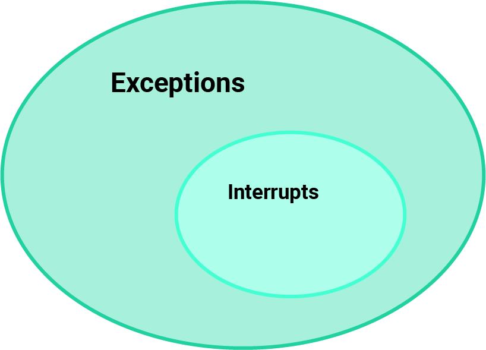
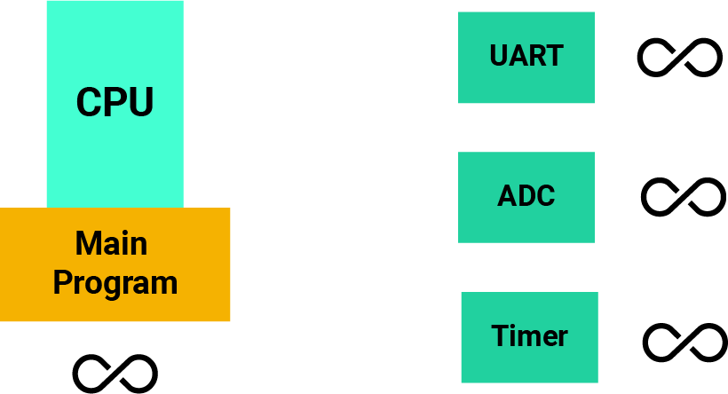

# Was ist ein Interrupt
## Exception
Eine Sache, die Sie häufig hören werden, wenn Sie zum Beispiel in Handbüchern über Interrupts lesen, sind "Exceptions". Manchmal werden diese beiden Begriffe sogar synonym verwendet. Genaugenommen gibt es verschiede Definitionen für die beiden Wörter je nach Architektur, die man verwendet oder wer die Anleitung geschrieben hat.

Generell gilt:
Eine **Exception** ist ein Ereignis, das den normalen Ablauf der CPU-Befehlsausführung verändern kann.

Es ist allgemein anerkannt, dass Interupt eine Untermenge von Exceptions sind. Interrupts sind etwas, das den Prozessor von seinen Aufgaben abhalten und den Programmablauf verändern kann, aber Exceptions umfassen mehr als nur Interrupts

**Exceptions**
"abnormal Interne Ereignisse"

z.B.
* Invalid Instruction
* Illegal bus access

**Interrupts**
"Hardware Driven Signals"

z.B.
* External Signals
* Peripheral Flags

# Warum wollen wir Interrupts

Warum sollte ich meinen Programmablauf unterbrechen wollen? Normalerweise möchte ich, dass mein Programm deterministisch ist und immer die gleiche Ausgabe hat. 

Stellen wir uns vor, wir haben ein Programm, das Daten über den UART empfangen muss, mit einem Sensor über den ADC interagieren muss oder einen Timer hat, der irgendwie abläuft, um Ereignisse zu planen. 
Wir müssen das Hauptprogramm und die CPU mit diesen Peripheriegeräten kommunizieren und mit dem Hauptprogramm interagieren lassen.

# Polling
Eine Möglichkeit, dies zu tun, ist eine Technik namens Polling.
Polling ist ziemlich einfach. Alles, was es ist, ist, dass Ihr Hauptprogramm, während es alles andere tut, was es zu tun hat, einfach nacheinander zu jedem Peripheriegerät geht, das es bedienen muss, und den Status des Geräts abfragt.
Zum Beispiel wird es den UART fragen, ob ein Sendevorgang abgeschlossen ist. Es könnte den ADC abfragen, um zu sehen, ob meine letzte Konvertierung abgeschlossen ist, oder es könnte den Timer abfragen, um zu sehen, ob ich ein Signal oder einen Timeout oder was auch immer erfasst habe.

Stellen Sie sich also vor, dass Ihr Programm diese Dinge kontinuierlich abfragt, während Sie gleichzeitig andere Dinge tun. Diese Technik funktioniert und ist einfach zu machen, aber es gibt ein großes Problem. Oft arbeiten die Peripheriegeräte, mit denen wir interagieren müssen, mit viel niedrigeren Geschwindigkeiten als die CPU getaktet ist.
Wir verschwenden also eine Menge Zeit damit, auf Ergebnisse zu warten, die wahrscheinlich nicht einmal annähernd verfügbar sind.

# Interrupts
Interrupts betrachten das Problem aus einem anderen Blickwinkel.

## Analogy
Stellen wir uns unseren Chef als das Hauptprogramm vor. Unser Chef hat eine Menge anderer Aufgaben, als zu kontrollieren, was die Mitarbeiter tun. Wenn die einzige Aufgabe des Chefs darin bestünde, jeden einzelnen Mitarbeiter zu fragen, was er tut, wäre das eine Verschwendung seiner Zeit.

// Analogy zu ende :)

Interrupts ist eine andere Technik, bei der Unterbrechung verwendet werden, um die Zeit der CPU besser zu nutzen.
Die Hauptidee hinter Interrupts ist, dass das Hauptprogramm die Peripheriegeräte nicht ständig fragt: "Bist du schon fertig?
die Peripheriegeräte der CPU mitteilen, wenn sie mit einer Aufgabe fertig sind oder wenn etwas passiert ist.

Nehmen wir zum Beispiel an, der ADC ist mit einer Umwandlung fertig. Er könnte ein Flag setzen, das im wahrsten Sinne des Wortes nur eine Hardware-Leitung ist, die sagt: "Hey! Ich bin fertig." Dann kann das Hauptprogramm zurückkommen und den ADC nach den Daten fragen, die er verarbeitet hat.

Im Kern handelt es sich um eine unterbrechungsgesteuerte Programmierung, bei der jede Hardwarekomponente eine Aufgabe hat und ein Flag erzeugt, wenn diese Aufgabe erledigt ist. 
So funktionieren Interrupts und Ausnahmen auf fast jeder Prozessorplattform.

# Was passiert wenn ein Interrupt / Exception auftritt
**Bitte beachte, dass es sich bei den folgenden Informationen um einen allgemeinen Prozess handelt. Jede Implementierung kann ein wenig anders sein.**

## 1.
Wenn die CPU eine Unterbrechung erhält, kann sie nicht einfach sofort aufhören, was sie tut. Sie muss etwas tun, das "Saving Progress" genannt wird, damit sie weiß, wo sie sich befindet, wenn sie ihre Aufgabe wieder aufnimmt. Der dafür üblicherweise verwendete Mechanismus wird als "CPU-Stack" bezeichnet.  

## 2.
Sobald der Kontext gespeichert ist, muss die CPU wissen, wohin sie gehen und was sie ausführen soll, wenn eine Unterbrechung auftritt. Daher muss sie die Adresse des Interrupt-Service-Handlers, auch Interrupt-Service-Routine (ISR) genannt, aus einer sogenannten Vektortabelle abrufen. Eine Vektortabelle ist einfach eine Tabelle im Speicher, die die Adressen aller Interrupt-Service-Handler enthält.  

Das Konzept des **ISH** ist in den meisten Architekturen gleich. Es handelt sich lediglich um eine Tabelle, die Informationen darüber enthält, was zu tun ist, wenn eine Unterbrechung auftritt.

Wann immer ein Prozessor entworfen wird, wird der Designer eine bestimmte Anzahl von Interrupt-Quellen abbilden und ihnen einen Index zuweisen, so dass z.B. der UART bei Index 10 sein kann, so dass die CPU zum Tabelleneintrag 10 geht und dort nach der Adresse des Interrupt-Handlers sucht

## 3. - 4.
Sobald dies geschieht, springt die CPU zum Interrupt Service Handler.
Der Interrupt Service Handler ist einfach Code. Er tut einfach etwas und ist vergleichbar mit einem Sprung zu einem anderen Miniprogramm, in dem Sie vielleicht Flags löschen, einige Operationen durchführen usw.

## 5.
Sobald dies geschehen ist, wird der Interrupt Service Handler beendet

**Ablauf:**
1. CPU Speichert den aktuellen Kontext (Programmzähler, Register, etc...)
2. CPU holt die Adresse des **Interrupt-Service-Handler** aus einer Vektortabelle (jeder Interrupt hat einen Index in der Tabelle)
3. CPU springt zum Interrupt Service Handler
4. **Interrupt-Service-Handler** führt eine Operation aus (Clears flags, etc...)
5. **Interrupt-Service-Handler** beendet sich...
6. CPU stellt den Kontext wieder her und kehrt zum Hauptablauf zurück